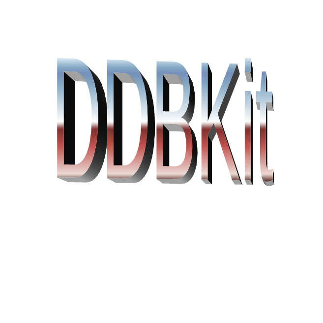

<div id="user-content-toc">
  <ul style="list-style: none;">
    <summary>
      <h1>DDBKit</h1>
    </summary>
  </ul>
</div>
<a href="https://github.com/sponsors/llsc12">

</a>

## What is it?
DDBKit stands for Declarative Discord Bot Kit, name proposed by [Tobias](https://github.com/tobiasdickinson). DDBKit is designed to abstract away the complexities of Discord’s API into something that feels right at home. Similar to SwiftUI, DDBKit lets you declare commands and add modifiers to create functionality in your bot. It’s kinda like [Commando](https://github.com/discordjs/commando). DDBKit relies on [DiscordBM](https://github.com/DiscordBM/DiscordBM) under the hood.

## Quick Start
Already know what you're doing? Get started faster by using the [DDBKit Template](https://github.com/DDBKit/DDBKit-Template).

## Getting started
Begin by making a new project directory with
```sh
mkdir MyNewBot && cd MyNewBot
```
Then make a new executable package in the directory with
```sh
swift package init --type executable
```
Open `Package.swift` in your preferred editor, and copy this configuration.
```swift
let package = Package(
  name: "rig",
  platforms: [
    .macOS(.v13)
  ],
  dependencies: [
    .package(url: "https://github.com/llsc12/DDBKit", exact: "0.1.4"), // change this to latest ver
  ],
  targets: [
    // Targets are the basic building blocks of a package, defining a module or a test suite.
    // Targets can depend on other targets in this package and products from dependencies.
    .executableTarget(
      name: "rig",
      dependencies: [
        .product(name: "DDBKit", package: "DDBKit"),
        .product(name: "Database", package: "DDBKit"),
        .product(name: "DDBKitUtilities", package: "DDBKit"),
        .product(name: "DDBKitFoundation", package: "DDBKit"),
      ]
    ),
  ]
)
```

You’ve now configured the package to use DDBKit! Next, rename the file at `./Sources/main.swift` to anything that isn’t `main.swift`, such as `Bot.swift`.
<details>
<summary>Why do this?</summary>
Having a file named <code>main.swift</code> makes it the entrypoint, and code is executed at the top level. DDBKit uses a protocol that declares it’s own entrypoint, you’ll declare a struct conforming to the protocol and you’ll prefix the struct with <code>@main</code>. This is the simplest setup for a discord bot with DDBKit. You can run multiple clients by executing the <code>run() async throws</code> method on each <code>DiscordBotApp</code> struct you've defined.
</details>

You can now replace any existing code in your Swift file with
```swift
import DDBKit

@main

struct MyNewBot: DiscordBotApp {
  init() async {
    let httpClient = HTTPClient()
    // Edit this as needed.
    bot = await BotGatewayManager(
      eventLoopGroup: httpClient.eventLoopGroup,
      httpClient: httpClient,
      token: "Token Here", // Do not store your token in your code in production.
      largeThreshold: 250,
      presence: .init(activities: [], status: .online, afk: false),
      intents: [.messageContent, .guildMessages]
    )
    // Will be useful
    cache = await .init(
      gatewayManager: bot,
      intents: .all, // it's better to minimise cached data to your needs
      requestAllMembers: .enabledWithPresences,
      messageCachingPolicy: .saveEditHistoryAndDeleted
    )
  }
  
  var body: [any BotScene] {
    ReadyEvent { ready in
      print("hi mom")
    }
    
    MessageCreateEvent { msg in
      guard let msg else { return }
      print("[\(msg.author?.username ?? "unknown")] \(msg.content)")
    }
  }
  
  var bot: Bot
  var cache: Cache
}
```
Congratulations! You’ve connected to Discord as your bot and reacted to an event!

> [!NOTE]
> **Using Linux**? Run <code>swift run</code> in the project directory.
> 
> **If you need another entrypoint (iOS, etc.)**; you can run a DiscordBotApp instance with the <code>run() async throws</code> function available on your Bot struct. You can use this to run multiple clients at once if needed. If deploying to an iOS device or similar, it's easier to use [DiscordBotShell](https://github.com/DDBKit/DiscordBotShell).
>
> **Don't have a bot yet?** You can create one at https://discord.com/developers/applications. Make sure your bot has the correct permissions and intents.

> [!WARNING]
> You cannot use logic in the `body` property; The property is only read once on startup.
> Commands are registered in batch globally or per groups with [guild targets](https://github.com/llsc12/DDBKit/wiki/2.-Getting-Started#first-command).
> Logic is only evaluated in defined events and commands, and their respective modifiers that accept code.

You've now got a solid place to start with your bot. Check out the [wiki](https://github.com/llsc12/DDBKit/wiki) for more information!

## Contributing
Feel free to work on providing more abstractions and adding general utilities.
My code isn't exactly amazing so if you'd like to improve it for everyone else, be sure to make a PR!
I have a silly database thing going on. I think it might be useful but it also might be dumb and bad at large scale. If someone rewrites it to use a real database behind the scenes whilst also providing more utilities, it would be much appreciated.

Contributors should clone this repository and open `DDBKit.xcworkspace` as it loads the example bot alongside the DDBKit package. This way, you can test your work live whilst making changes. You can also create your own tests if you'd like.

I only ask that contributions are somewhat commented in cases of dense code or wherever fit. 
Use `self` explicitly whenever it's used.
Someone should PR a linter :3

## Goals
- [x] Using builders for composable objects (main bot logic, messages etc.)
- [ ] Abstraction over common objects (eg. extending objects like Interaction with useful methods)
- [ ] Feature parity with Discord
- [ ] Make database good
- [x] Add linter (added as GH Action)
- [ ] Links in DocC comments of objects to more thorough wiki docs

## Sponsoring
If you really love this project, you should first support [DiscordBM's development](https://github.com/DiscordBM/DiscordBM) above all, considering it lies as the foundation of DDBKit.
Afterwards, feel free to sponsor the development of DDBKit and my other projects!

[](https://github.com/sponsors/llsc12)
